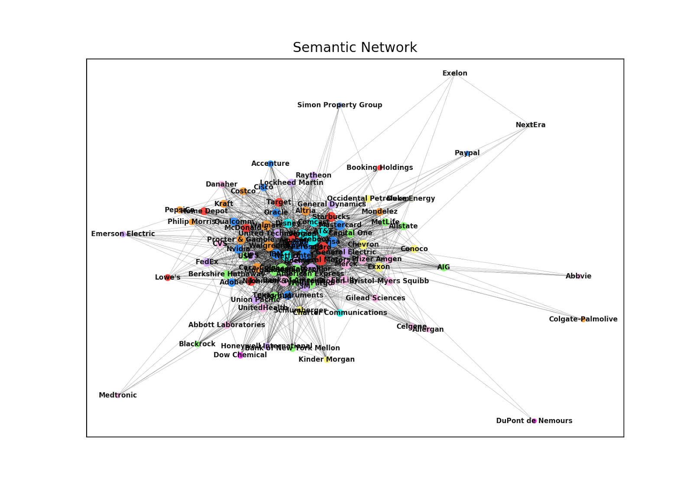
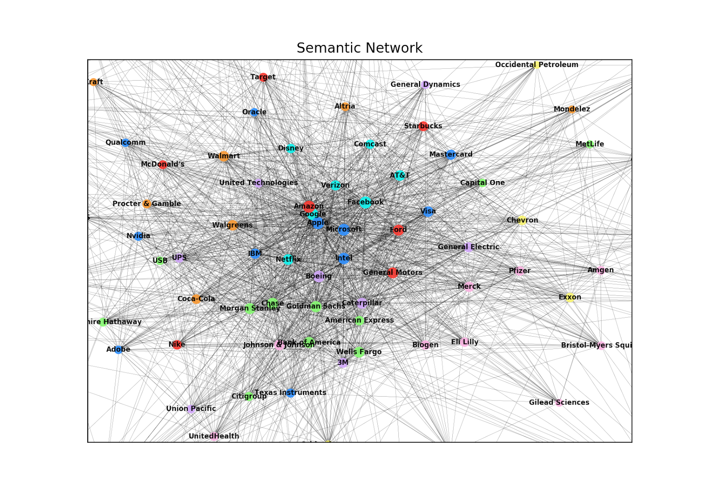
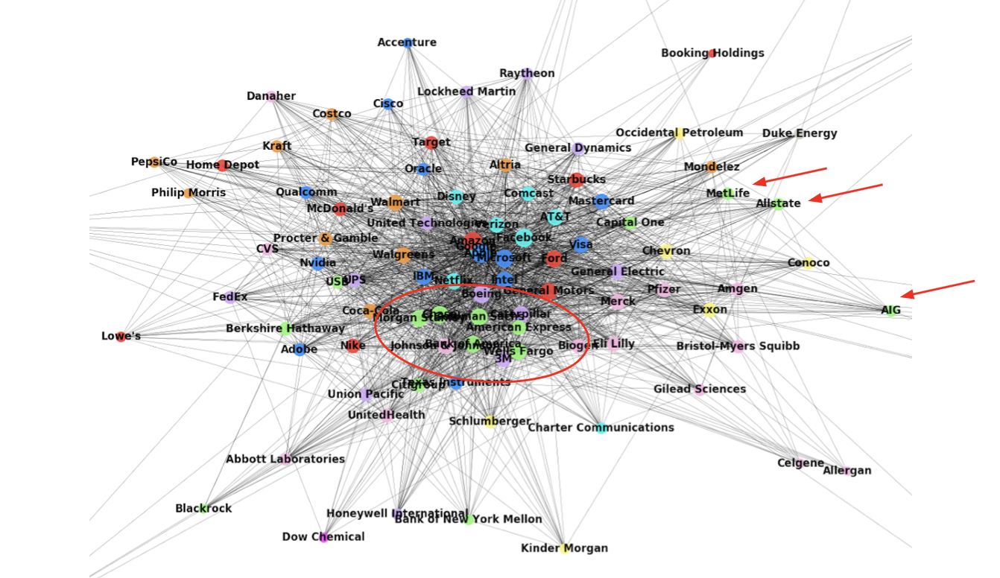

# Semantic Networks of the Stock Market 

This project was written for ELEC 573 - Network Science & Analytics - at Rice University. Our full report can be read in `report.pdf`.

### The Goal
There is a lot of work done trying to make sense of the countless datapoints produced by the stock market every day. One focus of this work is to better understand the relationships between stocks: how one stock’s performance influences other stocks. There are several ways of defining these relationships, including by industry, by stock value thresholds, or even geographically.

**Our goal is to avoid these rigidly defined relationships and instead capture the publicly perceived relationships between stocks.** Specifically, we chose stocks as nodes and define edge weights as the frequency with which stocks are mentioned together. We capture this information by scraping financial news articles and checking how often stocks are mentioned in the same article.

We then perform multiple analyses on the resulting graph and look for correlations between graph properties and financial data in hopes of uncovering new understandings of the community of stocks.

### Building The Network
We focused only on stocks in the S&P 100 for the sake of interpretability as well as availability of news media. We then arbitrarily selected 11 popular news sources to scrape from. We scraped news articles about each company in the S&P 100 from these news sources to build our dataset.

We then construct our network consisting of 100 nodes: one for each company. We then define edge weights between nodes as the the frequency with which the companies are mentioned together in the same news article. That is, if Apple and Google are mentioned in the same news article, their edge weight increases by 1. The result is stronger edge weights between companies that are more "semantically" similar based on the way that people talk about them.

### The Network
Below is a high-level image of our network. Companies are colored by sector based on the Global Industry Classification Standard (GICS) used by the S&P. From a high-level view, we generally see companies in similar sectors close to each other in the network.

 Zooming into the network, we begin to see meaningful patterns emerge:

Many of the leading companies in the US have strong connections to each other and  companies in similar industries appear to be closely related within the graph. For example, we see several financial institutions in green group together at the bottom of the graph. Similarly, we see several healthcare related companies in pink on the right side of the graph. And, of course, the large tech companies like Microsoft and Apple are in the middle with very high degree.

While it is encouraging to see companies from similar sectors cluster together, one exciting feature of our network actually lies in the companies from different sectors that appear close together. Take, for example, Target and Walmart near the top left side of the graph. The two companies are classified into different sectors by the S&P’s official metrics. However, because the companies are commonly associated with each other, they appear fairly close to each other in our graph. Another example is Capital One on the right side of the image. While it is in the same "green" sector as banks like Wells Fargo and Goldman Sachs, it seems to be more closely associated with Visa and Mastercard (likely because of Capital One’s emphasis on their credit card offerings). This distinction would be lost by simply following the company’s sector classification.

Finally, we also see insurance companies Metlife, Allstate, and AIG on the right side of the graph. They separate from other financial institutions (in green), distinguishing themselves with more detail than their sector designation would give

## File Structure

`SemanticNetwork.py` - Constructs the semantic stock market network.

`sandbox.py` - Performs exploratory experiments on the network.

`correlations.py` - Compares our network to financial time series data to look for relationships.

`adj_matrix.csv` - Adjacency matrix that defines the relationships of our network.

`scrape.py` - Collects news article URL's for companies in the S&P 100 and puts them in `urls/`.

`getTimeSeriesData.py` - Collects time series data for companies in the S&P 100.

## Key Dependencies

[`networkx`](https://networkx.github.io) - Networks science package used to generate network and perform some analysis.

[`newsapi`](https://newsapi.org/docs/client-libraries/python) - Gets URL's of news articles related to our target companies.

[`newspaper`](https://newspaper.readthedocs.io/en/latest/) - Gets article text from URL of news article.

[`matplotlib`](https://matplotlib.org) - Used for visualizing data.

[`NumPy`](https://numpy.org) and [`pandas`](https://pandas.pydata.org) - Everyone's favorite tools for organizing and handling data.
